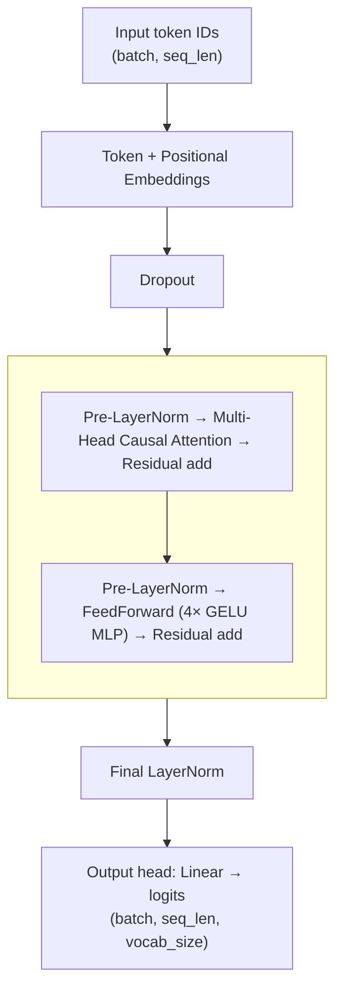

# gpt-from-scratch

> Build a working GPT-style language model from first principles — every layer, hand-written in PyTorch.

[](https://www.python.org/)
[](https://pytorch.org/)
[](LICENSE)
[](tests/)

A complete, from-scratch PyTorch implementation of a **GPT-style large language model**,
built line by line while working through Sebastian Raschka's
*[Build a Large Language Model (From Scratch)](https://www.manning.com/books/build-a-large-language-model-from-scratch)*.

## Why this repo

Most "learn LLMs" projects stop at calling `AutoModel.from_pretrained()`. This one doesn't.
Every component — tokenization, embeddings, causal attention, normalization, the transformer
block, the training loop — is implemented directly, so you can see exactly what happens at
each step from raw text to trained weights. No Hugging Face wrappers, no hidden magic.

## Architecture



| Component | File | What it does |
|---|---|---|
| BPE tokenizer helpers | `src/gpt_from_scratch/tokenizer.py` | `load_tokenizer()`, `text_to_token_ids()`, `token_ids_to_text()` |
| `MultiHeadAttention` | `src/gpt_from_scratch/attention.py` | Causal multi-head scaled dot-product attention |
| `LayerNorm`, `GELU`, `FeedForward`, `TransformerBlock` | `src/gpt_from_scratch/transformer.py` | Pre-LN residual block (norm → sublayer → add) |
| `GPTModel` | `src/gpt_from_scratch/model.py` | Embeddings → N blocks → final norm → output head |
| `GPTDatasetV1`, `create_dataloader()`, `load_text()`, `train_val_split()` | `src/gpt_from_scratch/data.py` | Sliding-window next-token dataset |
| `generate_text_simple()`, `generate_text()` | `src/gpt_from_scratch/generate.py` | Greedy decoding + temperature/top-k sampling |
| `train_model_simple()`, `build_model_from_config()`, CLI | `src/gpt_from_scratch/train.py` | Loss, eval, optimizer loop, `train-gpt` entry point |

## Features

- **Full GPT-2 small architecture** (12 layers, 12 heads, 768-dim, 1024 context) implemented from scratch
- **Import-safe package** — importing `gpt_from_scratch` has zero side effects: no downloads, no model instantiation, no training
- **Reproducible training CLI** — all hyperparameters (model *and* training) live in one YAML file
- **Two generation modes** — greedy argmax decoding and temperature/top-k sampling
- **Tested components** — `pytest` suite covering attention masking, normalization, shapes, and the data pipeline
- **Pedagogical notebook** — `notebooks/01_building_gpt_step_by_step.ipynb` walks through the entire model, runnable top to bottom

## Quickstart

```bash
# 1. Clone and install (uv or pip)
git clone https://github.com/zamaniali1995/gpt-from-scratch.git
cd gpt-from-scratch
uv sync            # or: pip install -e .

# 2. Train the GPT-2 small config for 1 epoch on The Verdict
train-gpt --config configs/gpt2_small.yaml --epochs 1 --out-dir checkpoints
# (scripts/train.py exposes the same --config / --epochs / --out-dir flags)
```

Expected output (CPU, a few minutes):

```
Using device: cpu
Model parameters: 163,009,536
Total characters: 20479
Train batches: 9, Val batches: 1
Epoch 1 (Step 000000): Train loss 10.045, Val loss 10.014
Epoch 1 (Step 000005): Train loss 7.907, Val loss 8.376
Every effort moves you ...
Saved checkpoint to checkpoints/gpt2_small.pt
```

> **Note:** one epoch on a 20 KB story barely teaches the model English — the
> generated sample will be charming gibberish. Train longer (or on more text)
> for coherent output. See the notebook for the full walkthrough.

```python
# 3. Use it from Python
import torch
from gpt_from_scratch import GPTModel, generate_text, text_to_token_ids, token_ids_to_text

model = GPTModel(vocab_size=50257, emb_dim=768, context_length=1024,
                 n_heads=12, n_layers=12, drop_rate=0.1)
model.load_state_dict(torch.load("checkpoints/gpt2_small.pt", map_location="cpu"))

idx = text_to_token_ids("Every effort moves you")
out = generate_text(model, idx, max_new_tokens=50, context_size=1024,
                    temperature=0.8, top_k=50)
print(token_ids_to_text(out))
```

## Project structure

```
gpt-from-scratch/
├── configs/
│   └── gpt2_small.yaml          # model + training hyperparameters (single source of truth)
├── data/
│   └── the-verdict.txt          # training text (Edith Wharton; auto-downloaded if missing)
├── notebooks/
│   └── 01_building_gpt_step_by_step.ipynb   # runnable pedagogical walkthrough
├── scripts/
│   └── train.py                 # thin CLI wrapper -> gpt_from_scratch.train:main
├── src/
│   └── gpt_from_scratch/
│       ├── __init__.py          # public API exports, __version__ (no import side effects)
│       ├── tokenizer.py         # BPE encode/decode helpers
│       ├── attention.py         # MultiHeadAttention
│       ├── transformer.py       # LayerNorm, GELU, FeedForward, TransformerBlock
│       ├── model.py             # GPTModel
│       ├── data.py              # load_text, GPTDatasetV1, create_dataloader, train_val_split
│       ├── generate.py          # greedy + temperature/top-k generation
│       └── train.py             # loss fns, training loop, config builder, CLI
├── tests/                       # pytest suite (attention, transformer, model, data)
├── pyproject.toml               # hatchling build, deps, train-gpt console script
├── LICENSE                      # MIT
└── README.md
```

## Configuration

Everything is controlled by one YAML file (`configs/gpt2_small.yaml`):

```yaml
model:
  vocab_size: 50257      # BPE vocabulary size (GPT-2 tokenizer)
  context_length: 1024   # max sequence length
  emb_dim: 768           # embedding dimension
  n_heads: 12            # attention heads per block
  n_layers: 12           # transformer blocks
  drop_rate: 0.1
  qkv_bias: false

training:
  epochs: 1
  batch_size: 2
  max_length: 256        # training chunk length
  stride: 256            # sliding-window step
  learning_rate: 0.0004
  weight_decay: 0.1
  eval_freq: 5
  eval_iter: 1
  train_ratio: 0.9
  start_context: "Every effort moves you"
  seed: 123
  data_path: "data/the-verdict.txt"
  checkpoint_dir: "checkpoints"
```

CLI flags override the file: `--config`, `--epochs`, `--out-dir`.

## Key concepts

Working through this repo meant actually implementing (not just reading about):

- **Why attention scores are scaled by `√head_dim`** before softmax — without it, large dot products saturate the softmax and kill gradients
- **How multi-head attention splits one learned projection** across heads via `view` + `transpose`, then recombines them — cheaper than per-head matrices, exactly equivalent
- **`nn.Embedding` vs `nn.Linear`** — an embedding lookup is mathematically a one-hot vector times a weight matrix; the table is learned by backprop
- **Why token *and* positional embeddings are both learned** — embeddings carry meaning, positions carry order; "dog bites man" ≠ "man bites dog"
- **Pre-LN vs post-LN** — normalizing *before* each sublayer (GPT's choice) keeps gradients stable through deep stacks
- **Why logits are flattened before `cross_entropy`** — reshaping `(batch, seq, vocab)` → `(batch×seq, vocab)` treats every position as an independent next-token prediction
- **What `stride` does** — smaller stride = more overlapping windows = more training examples from the same text, at the cost of redundancy
- **Why val loss rises while train loss falls** on a tiny dataset — the model memorizes the story; expected, not a bug

## Roadmap

- [ ] Load OpenAI's pretrained GPT-2 weights into `GPTModel` and compare with the from-scratch trained model
- [ ] Experiment with smaller `stride` for more training examples from limited text
- [ ] Add learning-rate scheduling (warmup + cosine decay) to the training loop
- [ ] Explore swapping the dense `FeedForward` for a Mixture-of-Experts layer (router + top-k expert gating, à la Mixtral)

## Acknowledgments

Built while working through Sebastian Raschka's [*Build a Large Language Model (From Scratch)*](https://www.manning.com/books/build-a-large-language-model-from-scratch).
Architecture and training approach closely follow the book; this repo is a hands-on
implementation and understanding exercise, not an original contribution.

## License

MIT — see [LICENSE](LICENSE).
